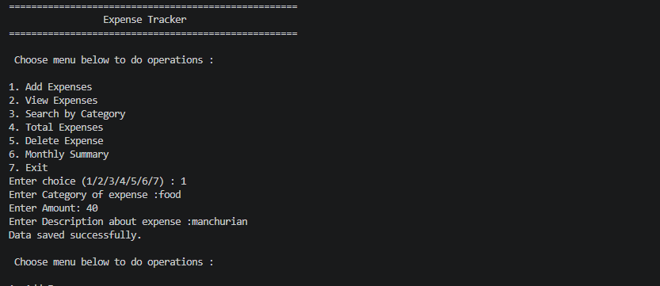
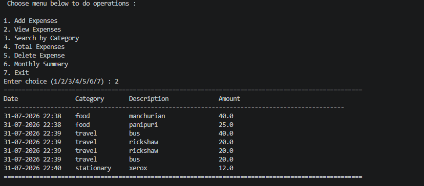
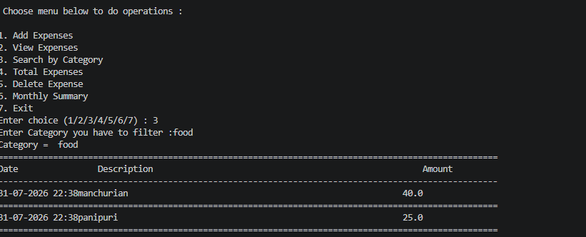
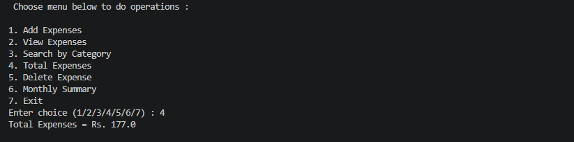
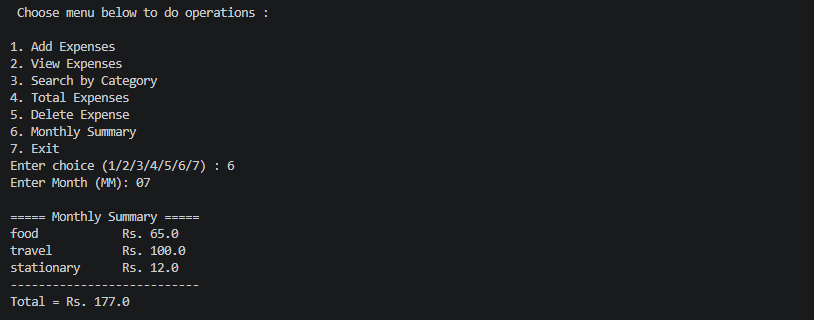
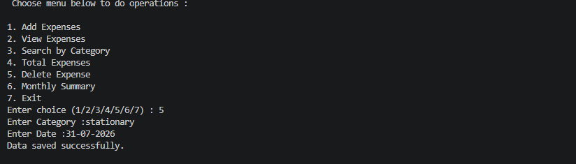

# 💰 Expense Tracker

A simple and user-friendly **Expense Tracker** developed in **Python**. This console-based application helps users record daily expenses, store them in a JSON file, search expenses by category, calculate total spending, and generate monthly expense summaries.

This project was built to practice **Python fundamentals, file handling, dictionaries, lists, functions, exception handling, and the `datetime` module**.

---

# ✨ Features

* ➕ Add new expenses
* 📋 View all saved expenses
* 🔍 Search expenses by category
* 💵 Calculate total expenses
* 📅 Generate monthly expense summary
* 🗑️ Delete an expense
* 💾 Store data permanently using JSON
* ⚠️ Input validation using exception handling

---

# 🛠️ Technologies Used

* Python 3
* JSON File Handling
* `datetime` Module

---

# 📚 Concepts Learned

* Variables and Data Types
* Lists
* Dictionaries
* Functions
* Loops
* Conditional Statements
* Exception Handling (`try-except`)
* File Handling (`json`)
* Date and Time (`datetime`)
* CRUD Operations (Create, Read, Delete)

---

# 📂 Project Structure

```text
Expense-Tracker/
│
├── expense_tracker.py
├── expenses.json
├── README.md
└── screenshots/
    ├── add_expense.png
    ├── view_expenses.png
    ├── search_category.png
    ├── total_expenses.png
    ├── monthly_summary.png
    └── delete_expense.png
```

---

# ▶️ How to Run

### 1. Clone the Repository

```bash
git clone https://github.com/ppraju7709/Python-Roadmap/new/main/01-Python-Fundamentals/MP4-Expense%20Tracker.git
```

### 2. Open the Project Folder

```bash
cd Expense-Tracker
```

### 3. Run the Program

```bash
python expense_tracker.py
```

---

# 📋 Menu Options

```text
==============================
      Expense Tracker
==============================

1. Add Expenses
2. View Expenses
3. Search by Category
4. Total Expenses
5. Delete Expense
6. Monthly Summary
7. Exit
```

---

# 💾 Data Storage

All expense records are stored in **expenses.json**.

Example:

```json
[
    {
        "Category": "Food",
        "Amount": 250.0,
        "Description": "Pizza",
        "Date": "31-07-2026 20:15"
    },
    {
        "Category": "Travel",
        "Amount": 120.0,
        "Description": "Bus Ticket",
        "Date": "31-07-2026 21:00"
    }
]
```

---

# 📸 Screenshots


## ➕ Add Expense



---

## 📋 View Expenses



---

## 🔍 Search by Category



---

## 💵 Total Expenses



---

## 📅 Monthly Summary



---

## 🗑️ Delete Expense



---

# 📖 Sample Output

## Add Expense

```text
Enter Category of Expense : Food
Enter Amount : 250
Enter Description : Pizza

Data saved successfully.
```

## View Expenses

```text
====================================================================================================
Date                Category       Description               Amount
----------------------------------------------------------------------------------------------------
31-07-2026 20:15    Food           Pizza                     250.0
31-07-2026 20:30    Travel         Bus Ticket                120.0
====================================================================================================
```

## Monthly Summary

```text
===== Monthly Summary =====

Food            Rs. 250.0
Travel          Rs. 120.0

---------------------------
Total = Rs. 370.0
```

---

# 🚀 Future Improvements

* ✏️ Update/Edit an existing expense
* 🔢 Delete expenses using serial number
* 📆 Filter expenses by custom date range
* 📊 Display expense statistics and charts
* 📄 Export expenses to CSV or Excel
* 🖥️ Build a graphical interface using Tkinter
* 💰 Add budget tracking and alerts
* 🔐 User login system

---

# 🎯 Learning Outcomes

This project helped me learn:

* Creating menu-driven Python applications
* Working with JSON for persistent storage
* Organizing code using functions
* Managing data using lists and dictionaries
* Using the `datetime` module
* Handling user input safely with exception handling
* Performing CRUD operations
* Building a real-world console application

---

# 👩‍💻 Author

**Prajakta Patil**

---

## ⭐ Support

If you found this project helpful or interesting, please consider giving it a ⭐ on GitHub.

Thank you for visiting this repository!
