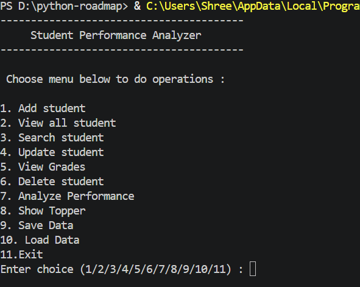
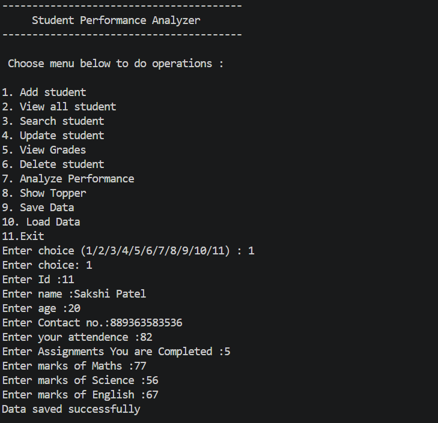
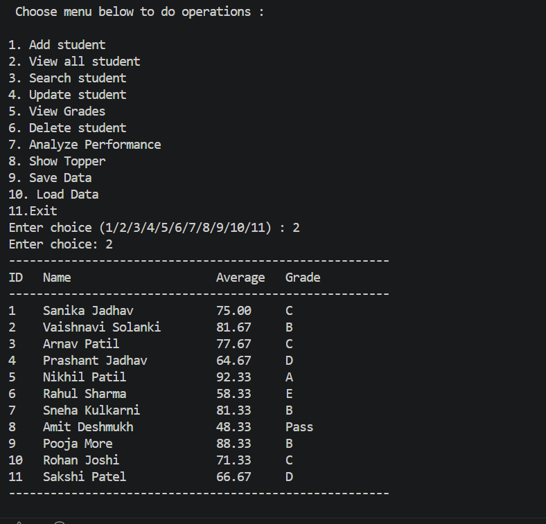
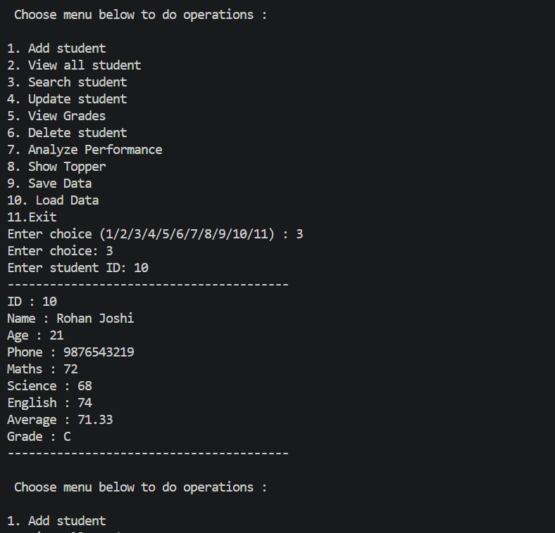
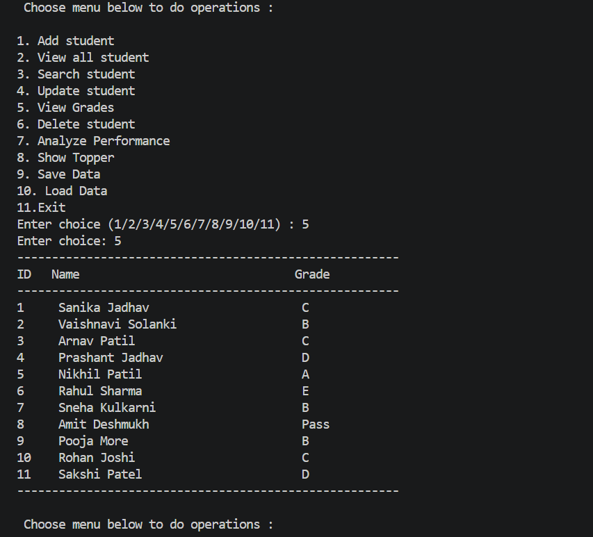
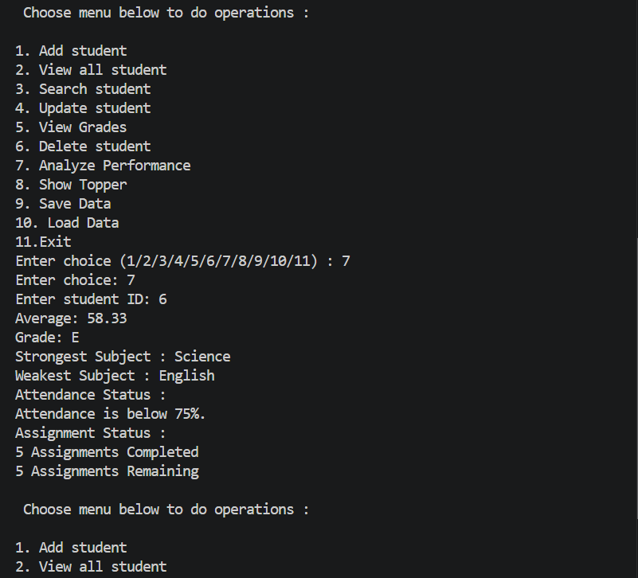
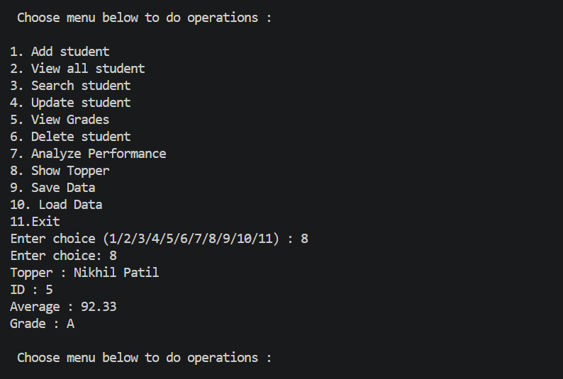

# 📊 Student Performance Analyzer

A Python console-based application to manage student records and analyze their academic performance. The application allows users to add, search, update, delete, and analyze student data while storing records permanently using JSON file handling.

---

## 🚀 Features

- ➕ Add Student
- 📋 View All Students
- 🔍 Search Student by ID
- ✏️ Update Student Information
- 🎓 View Student Grades
- ❌ Delete Student Record
- 📈 Analyze Student Performance
- 🏆 Show Topper
- 💾 Save Student Records (JSON)
- 📂 Load Saved Records

---

## 🛠️ Technologies Used

- Python 3
- JSON File Handling

---

## 📂 Project Structure

```
Student-Performance-Analyzer/
│
├── Student_Performance_Analyzer.py
├── student.json
├── README.md
└── screenshots/
    ├── menu.png
    ├── add_student.png
    ├── view_students.png
    ├── search_student.png
    ├── analyze_performance.png
    └── topper.png
```

---

## 📚 Python Concepts Used

- Variables
- Input & Output
- Conditional Statements
- Loops
- Functions
- Lists
- Dictionaries
- JSON File Handling
- Exception Handling
- CRUD Operations

---

## 📋 Menu Options

```
1. Add Student
2. View All Students
3. Search Student
4. Update Student
5. View Grades
6. Delete Student
7. Analyze Performance
8. Show Topper
9. Save Data
10. Load Data
11. Exit
```

---

## 🎯 Grade Criteria

| Average Marks | Grade |
|--------------|-------|
| 90 – 100 | A |
| 80 – 89 | B |
| 70 – 79 | C |
| 60 – 69 | D |
| 50 – 59 | E |
| 40 – 49 | Pass |
| Below 40 | Fail |

---

## 📊 Performance Analysis

The application provides:

- Average Marks
- Grade
- Strongest Subject
- Weakest Subject
- Attendance Status
- Assignment Status

---

## 💾 File Handling

Student records are stored in **student.json**.

- Save records permanently
- Load records automatically
- Prevent data loss after closing the program

---

## 📸 Screenshots

### 🏠 Main Menu


### ➕ Add Student


### 📋 View All Students


### 🔍 Search Student


### 🎓 View Grades


### 📈 Analyze Performance


### 🏆 Show Topper


---

## ▶️ How to Run

1. Clone the repository

```bash
git clone https://github.com/ppraju7709/Python-Roadmap/01-Python-Fundamentals/Student-Performance-Analyzer.git
```

2. Open the project folder

```bash
cd Student-Performance-Analyzer
```

3. Run the application

```bash
python Student_Performance_Analyzer.py
```

---

## 🌱 Future Improvements

- GUI using Tkinter
- Export reports to Excel
- Generate PDF Report Cards
- Data Visualization using Matplotlib
- Database Integration (MySQL)
- Flask Web Application
- Student Login System

---

## 👩‍💻 Author

**Prajakta Patil**
Computer Science Engineering Student

---

## ⭐ Support

If you found this project useful, consider giving it a ⭐ on GitHub!
